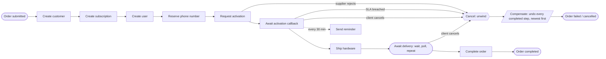

# Service Integration Layer — a workflow engine, learned by building one

A telecom **Service Integration Layer**: it drives VOIP and hardware order journeys between a
commercial order management system and a downstream supplier, on top of an embedded BPMN engine.

The domain is a vehicle. The point is to hit — with tests that actually prove it — every
orchestration concern that turns up in integration work: long-running processes, timers, engine-side
retries, dead letters, sagas with compensation, idempotency at three separate layers, correlation
IDs, a transactional outbox, and recovery after the application is killed mid-order.

Phase-by-phase reasoning and the full feature matrix live in [PLAN.md](PLAN.md).

## Engines side by side

Each engine gets its own module and **none replaces another**. The same order journey is meant to
end up implemented several times, runnable at the same time, so the implementations can be compared
directly instead of through git history.

| Module | Engine | Model | Status |
|---|---|---|---|
| [`engine-flowable`](engine-flowable) | Flowable 8, embedded | BPMN 2.0, engine inside the Spring context, state in the application's own Postgres | working |
| `engine-camunda8` | Camunda 8 / Zeebe | BPMN 2.0, remote broker, job workers | planned |

Everything engine-agnostic — the TMF APIs, the supplier adapter, idempotency, correlation, the
outbox — lives in [`sil-shared`](sil-shared) behind an `OrderOrchestrator` port. Adding an engine
means adding process definitions and their glue, not a second copy of the API.

## Quick start

Requires JDK 25 (the Gradle toolchain provisions it) and Docker.

```bash
docker compose up -d
```

```bash
./gradlew :engine-flowable:bootRun
```

Submit an order:

```bash
curl -s -X POST localhost:8080/tmf-api/serviceOrdering/v4/serviceOrder \
  -H 'Content-Type: application/json' -H 'X-Correlation-Id: demo' \
  -d '{"externalId":"OMS-1","customer":{"name":"Acme Ltd","email":"ops@acme.example"},
       "place":{"postcode":"SW1A 1AA"},"serviceSpecId":"VOIP_BUSINESS","speedMbps":100}'
```

It returns immediately with `"state": "inProgress"` — no supplier has been contacted yet. Poll
`GET /tmf-api/serviceOrdering/v4/serviceOrder/{id}` to watch provisioning fill in, and
`GET .../{id}/timeline` to see what the engine actually did.

API docs: `/swagger-ui.html`. Supplier stubs: `localhost:8081/__admin`. Broker UI:
`localhost:15672` (guest/guest).

## The order journey



Everything from `Create customer` to `Await delivery` runs inside a BPMN **transaction subprocess**,
which is what makes that unwind arrow real rather than decorative. The model is
[`serviceOrder.bpmn20.xml`](engine-flowable/src/main/resources/processes/serviceOrder.bpmn20.xml).

## What it demonstrates

**Durable, long-running work.** Every service task is async, so each supplier call gets its own
transaction boundary and its own retry counter, and the submitting request returns as soon as the
order is durable. Waiting costs one database row: a process parked on a callback or asleep between
shipment polls holds no thread and no memory.

**Recovery.** Kill the application mid-order, start it again, and the order finishes — with every
supplier call still having happened exactly once. Nothing in the codebase implements this; the
engine's state lives in the same database as the order. Walk through it in
[docs/recovery-demo.md](docs/recovery-demo.md), or read `MidProcessRestartIT`, which asserts it.

**Two instances, one database.** No job ever runs twice, including when the instance doing the work
dies mid-order and the survivor picks it up.

**Failure that is not the same as error.** A supplier rejection (4xx) is a BPMN error and takes the
rejection path at once; a 5xx or a timeout is retried by the engine — a retry being a row with a due
date, so it survives a redeploy. What runs out of retries lands in a dead letter queue, where
`GET /admin/workflow/dead-letter` says which order is stuck and why, and a resubmit continues from
the failed step rather than the beginning.

**A saga, not a rollback.** A database transaction cannot undo a customer that now exists in the
supplier's system. Every provisioning step has a compensating call attached to it in the model, and
they run in reverse order — proven by reading the order of DELETEs out of the stub's journal, not by
asserting that "compensation happened".

**Cancellation at any point.** The client's intent is recorded on the order and checked after every
step, so a cancellation arriving mid-provisioning is accepted rather than refused. Once it is
recorded, no further supplier call is made.

**Idempotency, three times over.** `Idempotency-Key` on the HTTP API; the engine's job executor for
supplier calls; and `processed_message` for the queue consumer. Each one is a primary key doing the
work, not a check-then-act.

**Events that cannot be lost or duplicated.** Order events are written to an outbox in the same
transaction as the order change, then published by a poller that sends before marking — so a crash
resends rather than loses, and the consumer's guard absorbs the duplicate.

**Traceability.** `X-Correlation-Id` follows a journey from the caller through the logs, into
process variables, back out on supplier calls made hours later on job executor threads, and onto the
event delivered to the client's listener.

## Tests

Two lanes, mirroring the two CI jobs.

Fast — unit and BPMN process tests on in-memory H2, no Docker, engine clock driven by hand so timers
and SLAs measured in hours are exercised in milliseconds:

```bash
./gradlew test
```

Integration — real Postgres, real RabbitMQ, real supplier stubs, real async executor, and
applications that are genuinely started and killed:

```bash
./gradlew integrationTest
```

Both, plus the build:

```bash
./gradlew build
```

## Working on the process model

The BPMN carries its diagram interchange, so it opens in any modeller (bpmn.io, Flowable Modeler,
Camunda Modeler). Edit it there rather than by hand — the layout was generated once to get the file
into a modeller, and the modeller owns it from now on. [CLAUDE.md](CLAUDE.md) records the modelling
rules this project learned the expensive way.

## Layout

```
.
├── PLAN.md                 # phase-by-phase plan and the feature/test matrix
├── CLAUDE.md               # working rules for this repo
├── docker-compose.yml      # postgres + wiremock + rabbitmq
├── sil-shared/             # engine-agnostic: TMF APIs, supplier adapter, idempotency, outbox
├── engine-flowable/        # the journey on an embedded Flowable engine
├── stubs/                  # WireMock mappings standing in for supplier APIs
├── docs/
│   ├── recovery-demo.md    # kill the app mid-order, by hand
│   └── variance-log.md     # where the API deviates from TM Forum, and why
└── .github/workflows/ci.yml
```

## Notes

- Spring Boot 4.1 with Flowable 8. Flowable 8 is the line built against Spring Boot 4 / Spring
  Framework 7; the 7.x line would pin the whole build back to Spring Boot 3.
- Flowable manages its own `ACT_*` schema in the same database as the business data. That
  co-location — process state and business state in one transaction — is the main reason this
  project uses an embedded engine rather than a remote broker, and the reason the recovery demo
  needs no code.
- Inbound APIs are unauthenticated on purpose; the OAuth2 work here is on the outbound side, where
  the supplier requires client credentials. See the variance log.
