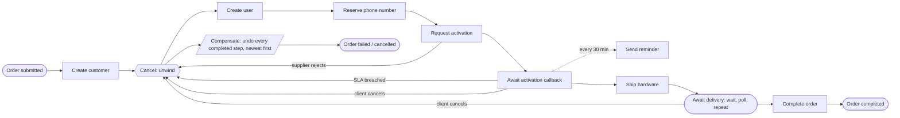

# Service Integration Layer — workflow engine playground

A learning project built around workflow orchestration: a telecom **Service Integration Layer**
that drives VOIP and hardware order journeys between a commercial order management system and
downstream suppliers, implemented on top of a BPMN engine.

The point is not the telecom domain — it is to hit, with tests, every orchestration concern that
shows up in real integration work: long-running processes, timers, retries, dead letters,
compensation (saga), idempotency, correlation IDs, transactional outbox, and clean recovery after a
mid-process restart.

The full breakdown lives in [PLAN.md](PLAN.md).

## Engines

Each engine gets its own module and **none replaces another** — the same order journey is meant to
end up implemented several times, side by side, so the implementations can be compared directly.

| Module | Engine | Model | Status |
|---|---|---|---|
| [`engine-flowable`](engine-flowable) | Flowable 8, embedded | BPMN 2.0, engine inside the Spring context, state in the app's own Postgres | Phases 0-1 done |
| `engine-camunda8` | Camunda 8 / Zeebe | BPMN 2.0, remote broker, job workers | planned |

Engine-agnostic code - the TMF APIs, the supplier adapter, idempotency and correlation - lives in
[`sil-shared`](sil-shared), so adding an engine means adding process definitions and their glue,
not a second copy of the API.

## What works today

TMF645 Service Qualification, end to end and synchronous:

- `POST /tmf-api/serviceQualification/v5/checkServiceQualification` calls the supplier and stores
  the answer; `GET .../{id}` returns it later
- retrying with the same `Idempotency-Key` replays the first answer and does **not** call the
  supplier again; reusing the key with a different body is a 409
- `X-Correlation-Id` is echoed to the caller, written to every log line, forwarded to the supplier
  and stored with the result
- the supplier call has connect and read timeouts, bounded retry with exponential backoff, and a
  circuit breaker; a supplier outage becomes a 503 rather than a hung thread
- outbound calls carry an OAuth2 client-credentials token, fetched once and reused
- OpenAPI at `/v3/api-docs`, Swagger UI at `/swagger-ui.html`, deviations from TMF recorded in
  [docs/variance-log.md](docs/variance-log.md)

TMF641 Service Ordering, fulfilled by a BPMN process:

- `POST /tmf-api/serviceOrdering/v4/serviceOrder` stores the order, starts a workflow and returns
  immediately - no supplier has been contacted yet
- the workflow drives four supplier operations in order (customer -> subscription -> user -> number
  reservation), each as its own async job with its own transaction
- `GET .../{id}` reports the supplier references gathered so far; `GET .../{id}/timeline` reports
  the steps actually taken and how long each one took, read from engine history
- an order in flight when a new process version is deployed keeps running the version it started on



Everything from `Create customer` to `Await delivery` runs inside a BPMN **transaction subprocess**,
which is what makes the unwind arrow above real rather than aspirational.

Every service task is async, which is the point rather than an optimisation: each supplier call
gets its own transaction boundary, so a failure at step three does not undo the two remote side
effects that already happened - and from Phase 3, its own retry counter, stored in the database and
therefore surviving a restart.

The unreliable half - the part a workflow engine exists for:

- **Retries** are engine-managed (`R3/PT10S` per step). A retry is a row with a due date and a
  remaining count, so a redeploy in the middle of a backoff loses nothing
- **Dead letter queue** for work that exhausted its retries: `GET /admin/workflow/dead-letter` says
  which order is stuck and why, `POST .../{id}/retry` resumes it from the failed step once the
  cause is fixed. The order is parked, not failed and not half-applied
- **Business error vs technical failure**: a supplier rejection (4xx) is raised as a BPMN error and
  takes the rejection path immediately; a 5xx or a timeout is retried. Retrying a rejection just
  annoys the supplier and delays telling the customer
- **Message correlation**: activation is confirmed later on `POST /callbacks/voip/number-activation`.
  A duplicate or late callback gets a 409 rather than disturbing an order that has moved on
- **Timers**: an interrupting SLA timer fails an order the supplier never confirmed; a repeating
  non-interrupting timer sends reminders without taking the order off its wait; a poll loop sleeps
  between shipment checks, costing nothing but a database row while it waits

The saga - because a database transaction cannot roll back a customer that now exists in the
supplier's system:

- every provisioning step has a compensating call attached to it in the model, and all of them run
  **in reverse order** when fulfilment cannot finish
- three ways in, one unwind path: the supplier rejects the activation, the SLA expires, or the
  client calls `POST /serviceOrder/{id}/cancel`
- the engine already knows how far the order got, so nothing has to answer "what did we do so far?"
  at each failure point - the alternative, unwinding by hand in a catch block, has to answer it
  everywhere
- cancellation is accepted while the order waits on the supplier (the hours and weeks where a
  client actually changes their mind) and refused with a 409 while a provisioning call is in flight
- an order reaches `cancelled` only after the last undo has succeeded; the supplier references are
  cleared as each one is undone

Not yet: the restart demo, the outbox and clustering. That is Phase 5.

## Requirements

- JDK 25 (the Gradle toolchain pins the build to 25 and will provision it if missing)
- Docker (integration tests and the local stack)

## Running

Start the local stack — Postgres, WireMock (supplier stubs), RabbitMQ:

```bash
docker compose up -d
```

Run the Flowable application:

```bash
./gradlew :engine-flowable:bootRun
```

Health check:

```bash
curl -s localhost:8080/actuator/health
```

## Tests

Two lanes, mirroring the two CI jobs.

Fast — unit and BPMN process tests on in-memory H2, no Docker needed:

```bash
./gradlew test
```

Integration — the same engine against a real Postgres via Testcontainers:

```bash
./gradlew integrationTest
```

Everything at once:

```bash
./gradlew build
```

## Layout

```
.
├── PLAN.md                 # phase-by-phase plan and the feature/test matrix
├── CLAUDE.md               # working rules for this repo
├── docker-compose.yml      # postgres + wiremock + rabbitmq
├── sil-shared/             # TMF APIs, supplier adapter, idempotency, correlation
├── engine-flowable/        # Service Integration Layer on an embedded Flowable engine
├── stubs/                  # WireMock mappings standing in for supplier APIs
├── postman/                # collection for poking at the API by hand
├── docs/                   # architecture, variance log, recovery demo, engine comparison
└── .github/workflows/ci.yml
```

## Working on the process model

`engine-flowable/src/main/resources/processes/serviceOrder.bpmn20.xml` carries its diagram
interchange, so it opens in any BPMN modeller. Edit it there rather than by hand - the layout in
the file was generated once to get it into a modeller, and the modeller owns it from now on.

## Notes

- Spring Boot 4.1.0 with Flowable 8.0.0. Flowable 8 is the line built against Spring Boot 4.0.x /
  Spring Framework 7; the older Flowable 7.x line would pin the whole build back to Spring Boot 3.x.
- Flowable manages its own `ACT_*` schema in the same database as the business data. That
  co-location — process state and business state in one transaction — is the main reason this
  project starts with an embedded engine rather than a remote broker.
